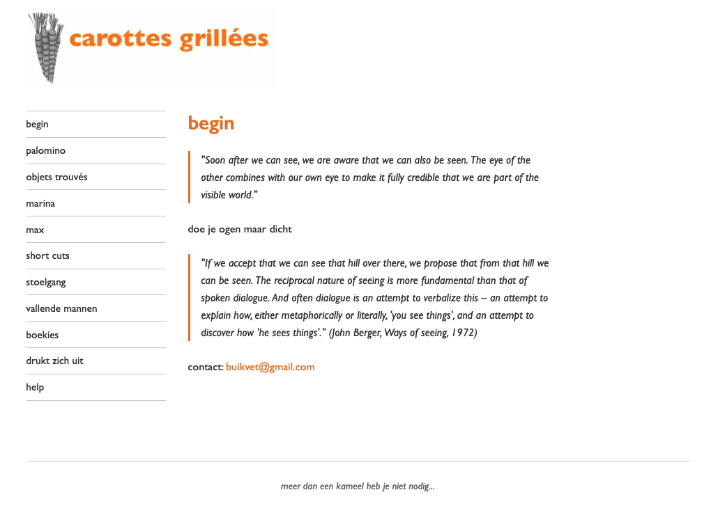
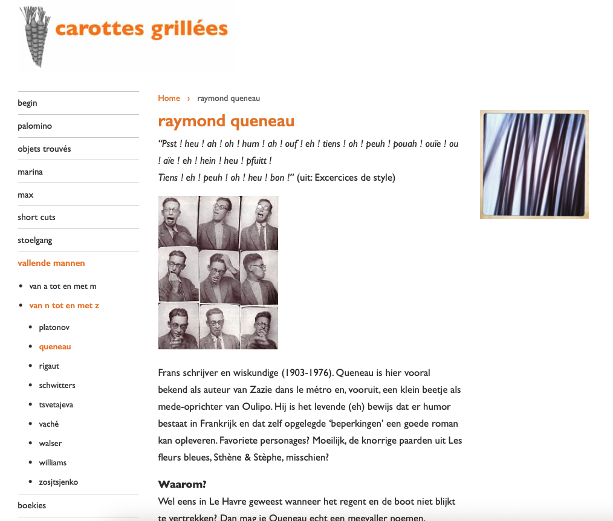
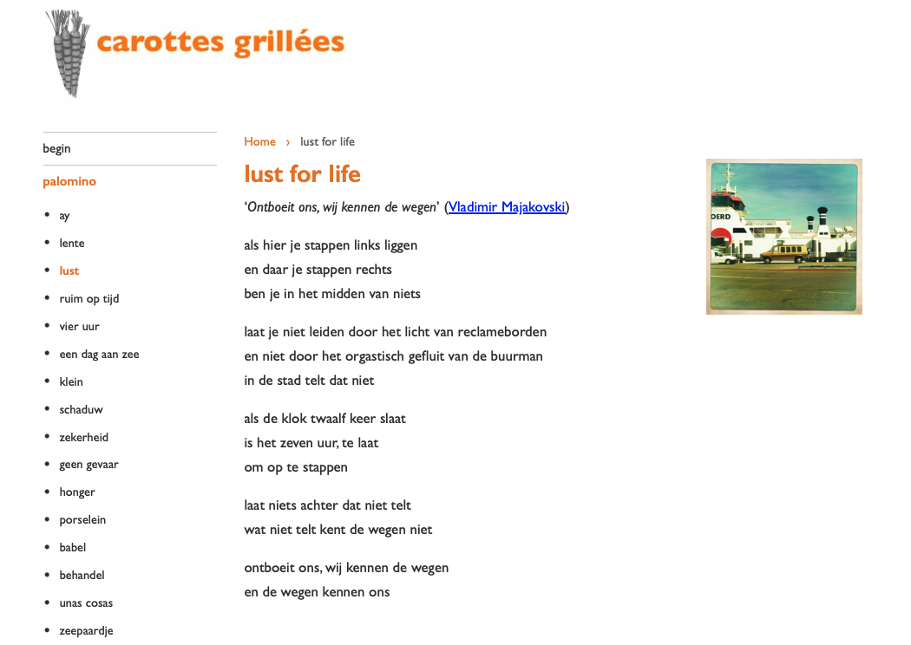
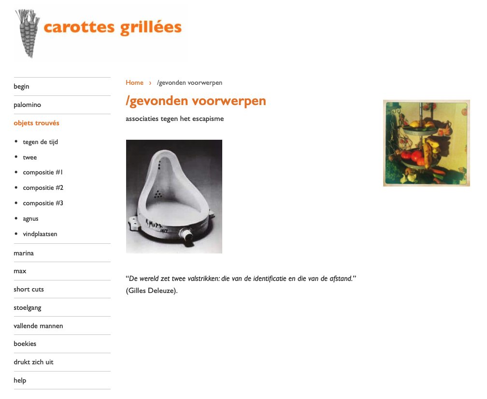

# Carottes grillées is terug online

Al jaren was de website van Jacob offline. De vormgeving was kapot, de site zag er niet uit, en we hadden er gewoon geen fut voor om het aan te pakken. Tot afgelopen zaterdagavond.

---

## Een korte geschiedenis

Carottes grillées begon ooit in Joomla. Toen Joomla 1.5 end-of-life ging, migreerden we naar een nieuwere Joomla-versie. Dat was al een heel gedoe. Daarna, ergens rond 2015, overgezet naar WordPress. Ook een hele klus.

En toen brak het thema. Ergens in de afgelopen jaren ging er iets stuk bij een update. De navigatie deed raar, de afbeeldingen stonden verkeerd, de hele boel zag eruit als een bouwval.

Jacob en ik keken ernaar en dachten: daar hebben we nu even geen energie voor.

Dus bleef het zo. Jaren.

---

## Zaterdagavond

Zaterdagavond besloot ik het eens te proberen. Niet met WordPress — daar had ik geen zin meer in. Maar met Hugo, een statische site generator waar ik ondertussen mee overweg kan. En met Claude Code als bouwpartner.

Het doel: de site overzetten naar Hugo met het originele design (zo veel mogelijk), en online krijgen via GitHub Pages.

---

## Hoe werkt dat dan?

Claude Code is een AI die met me meedenkt én uitvoert. Ik vertel wat ik wil, en Claude schrijft de code, past bestanden aan, en voert commando's uit. We werken samen in een terminal.

Eerst de content. Ik exporteerde alles uit WordPress als XML, en Claude zette dat om naar zo'n 90 markdown-bestanden — gedichten en verhalen van Jacob, netjes gestructureerd met de juiste metadata.

Toen het design. Het origineel was nergens meer te vinden, maar de Internet Archive had het bewaard. Ik dook erin, maakte screenshots van hoe de site er ooit uitzag, en gebruikte die als referentie. "Zo moet het eruitzien." Ook een ontbrekende afbeelding kon ik daar vandaan halen.

Wat nog moest:
- Een Hugo-thema bouwen dat lijkt op het origineel
- De navigatie opzetten (met submenu's en zelfs sub-submenu's)
- De afbeeldingen per sectie tonen (palomino, marina, max, vallende mannen...)
- Het geheel online krijgen

---

## Wat Claude Code deed

Claude bouwde het thema. De CSS, de templates, de menu-logica met drie niveaus diep. Ik gaf aan wat ik wilde: "de navigatie moet hiërarchisch zijn, met palomino als hoofditem en daaronder alle gedichten". Claude maakte het.

Ik zei: "bij elk gedicht uit de palomino-bundel moet rechts een afbeelding staan". Claude schreef de template-logica die de URL checkt en de juiste afbeelding toont.

Toen de styling kapot ging op GitHub Pages (absolute paden werken niet op een subdomein), zei ik: "de CSS laadt niet". Claude analyseerde het probleem en paste alle paden aan met Hugo's `relURL` functie.

---

## Wat ik deed

Ik was de opdrachtgever en de tester. De Internet Archive screenshots waren mijn referentie — zo moest het eruitzien. Ik klikte door de pagina's, zag wat er niet klopte, en gaf dat terug.

"Er zit te veel wit tussen de titel en het eerste vers."

"De afbeelding bij palomino is verkeerd — het moet hipstamatic-483 zijn."

"Het lettertype moet Gill Sans worden."

"De navigatie mist een item: 'lam' moet onder 'agnus' komen."

Ik exporteerde de XML uit WordPress. Ik haalde screenshots en een ontbrekende afbeelding uit de Internet Archive. Ik stelde de DNS in bij Freedom.nl. Ik klikte op 'Opslaan' in het GitHub Pages-scherm.

De beslissingen waren van mij. De uitvoering was van Claude.

---

## Drie uur later

De site staat online. Op het eigen domein: [carottesgrillees.nl](https://carottesgrillees.nl).

Alle gedichten staan erin. De navigatie werkt — inclusief drie niveaus diep bij 'vallende mannen'.

De afbeeldingen staan op hun plek. Elk gedicht uit een bundel toont rechts de bijbehorende afbeelding.

Het ziet er weer uit zoals het hoort te zijn.

---

## Wat dit voor mij betekent

Dit is precies waarom ik zo enthousiast ben over werken met AI.

Een migratie als deze zou me vroeger dagen of weken hebben gekost. Uitzoeken hoe Hugo werkt, de template-syntax leren, debuggen waarom iets niet rendert. Nu kostte het een zaterdagavond.

Niet omdat de AI alles zelf deed. Maar omdat ik kon focussen op *wat* ik wilde, terwijl Claude het *hoe* uitvoerde. Ik hoefde niet te weten hoe `hasPrefix` werkt in Hugo-templates. Ik hoefde alleen te weten dat ik gedichten wilde groeperen per bundel.

De wereld is groter geworden. Dingen die jarenlang bleven liggen omdat ze "te veel werk" waren, kunnen nu in een avond.

---

*Jacobs gedichten staan weer online. Dat was het belangrijkste.*
